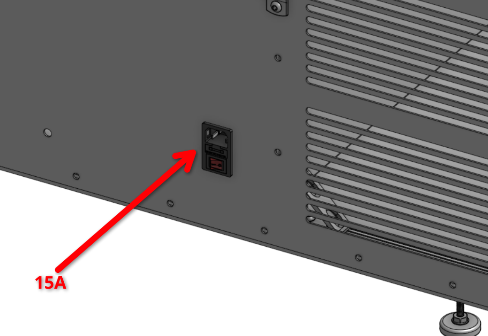
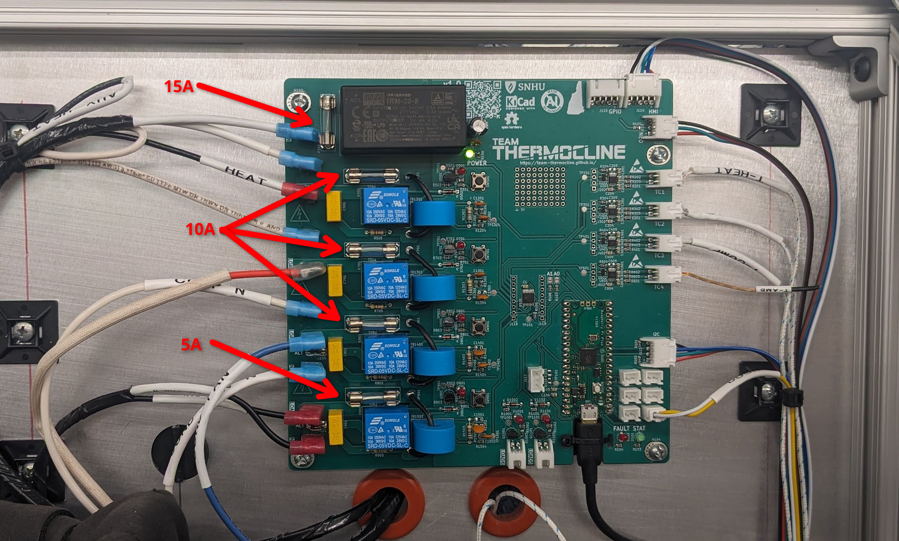
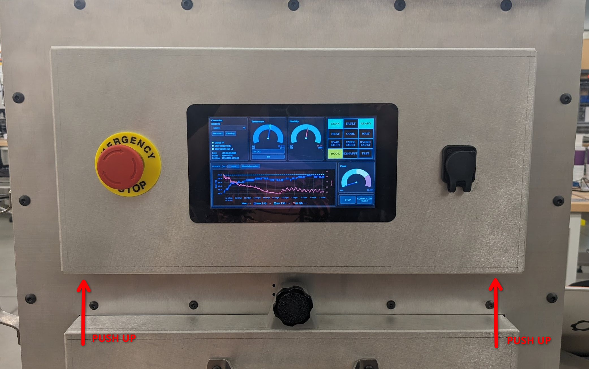
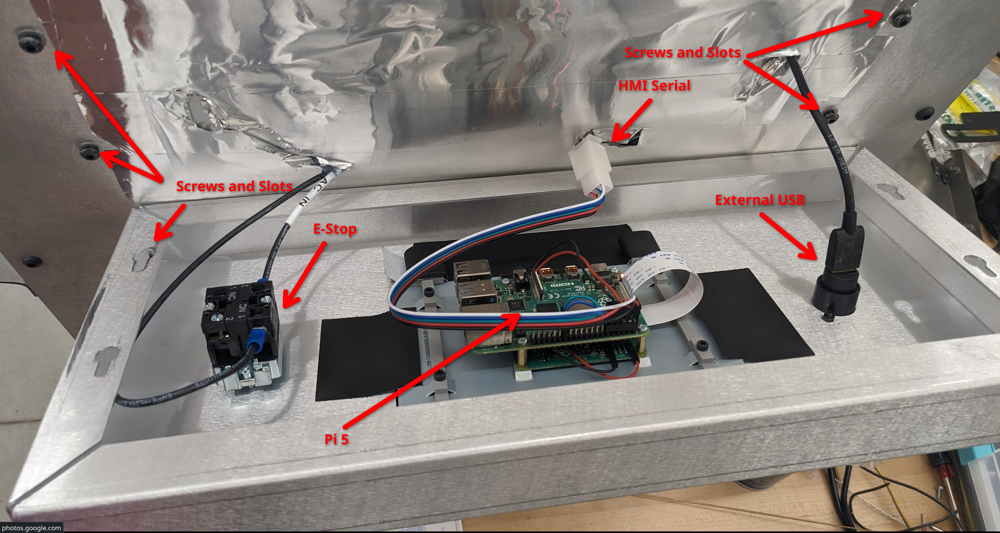

******************
Electrical Service
******************

Main Board
==========

The Main Board is the central controller PCB for the thermal testing chamber. It handles all the critical measuremnts, the high-power switching
and the centeral interconnect between HMI, a user laptop and the physical hardware.

Schematics
==========

The schematic files are stored on our 
`GitHub repository <https://github.com/Team-Thermocline/Controller/tree/main/Hardware/Main-Board>`_, 
but can also be viewed via `KiCanvas <https://kicanvas.org/>`_ 
on the web or at the end of the printed PDF Manual.

+-------------+---------------------------------------------------------------------------------------------------------------------------------------------------------------------------------------------------------------+
| Full System | `Full System Schematic <https://kicanvas.org/?repo=https%3A%2F%2Fgithub.com%2FTeam-Thermocline%2FController%2Fblob%2Ffeat%2Ffull_system_schematic%2FHardware%2FComplete-System%2FComplete-System.kicad_sch>`_ |
+=============+===============================================================================================================================================================================================================+
| Mainboard   | `Mainboard Interactive Schematic <https://team-thermocline.github.io/schematics/Main-Board.html#/>`_                                                                                                          |
+-------------+---------------------------------------------------------------------------------------------------------------------------------------------------------------------------------------------------------------+

Fuses
=====

The chamber uses 6 fuses total. One on the IEC plug on the side. And five more on the main board under
the rear panel.

There are three main fuses sizes, 15A, 10A and 5A.

.. warning:: Power the system down and unplug it before changing fuses! Fuses are LIVE when powered on!

Decorational Panel
==================

The decorational panel is a large sheet metal panel at the front of the machine that houses the raspberry
pi 5 HMI as well as the machine USB-C port and the E-Stop button.

The panel can be removed by pushing up evenly from the bottom and pulling gently off the front. It is
held in place by four screws in locking slots.

PCB Files
=========

* `Click here to View Layout <https://kicanvas.org/?repo=https://github.com/Team-Thermocline/Controller/blob/v1.0/Hardware/Main-Board/Main-Board.kicad_pcb>`_
  (PCB rendered and hosted on KiCanvas! There may be visual bugs; for best browsing experience view the PCB directly in KiCad!)
