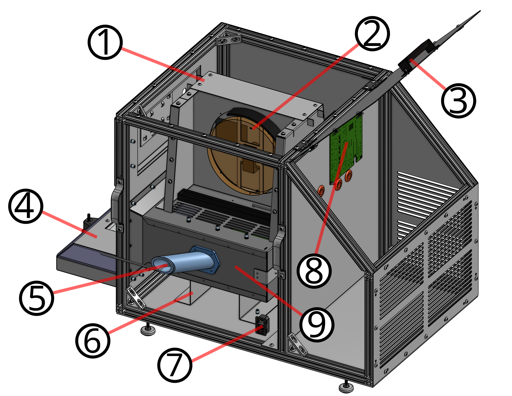

******************
Mechanical Service
******************

Regular Maintenance
===================

Serivce schedule is based on our best guess, we have not tested the machine for months at a time and certainly not a year.
Feel free to edit this page and adjust to the schedule that presents itself.

+----------------------------+-----+------+-------+-------+--------+--------+------------+
|                            | 1hr | 6hrs | 10hrs | 50hrs | 100hrs | 500hrs |  1000hrs   |
+============================+=====+======+=======+=======+========+========+============+
| Chamber gasket             |     |      |       | x     | x      | x      | x          |
+----------------------------+-----+------+-------+-------+--------+--------+------------+
| Check door gasket          |     |      |       |       | x      | x      | x          |
+----------------------------+-----+------+-------+-------+--------+--------+------------+
| Refrigerant System         |     |      |       |       |        |        | Run yearly |
+----------------------------+-----+------+-------+-------+--------+--------+------------+
| Check Internal Fan         |     |      |       | x     |        |        |            |
+----------------------------+-----+------+-------+-------+--------+--------+------------+
| Chamber Level              |     |      |       |       | x      |        |            |
+----------------------------+-----+------+-------+-------+--------+--------+------------+
| Check condenser attachment |     |      |       |       | x      |        |            |
+----------------------------+-----+------+-------+-------+--------+--------+------------+
| 3D Prints                  |     |      | x     |       |        |        |            |
+----------------------------+-----+------+-------+-------+--------+--------+------------+

See runtime hours in the **Debug Values** section of the HMI touch screen :doc:`using-the-hmi`.

System Structure
================

Inside the insulation houses the main chamber core. The basic assembly looks like this:

+--------+----------------------------+
| Number |        Description         |
+========+============================+
| 1      | "Trapezoid" outer paneling |
+--------+----------------------------+
| 2      | Circulation Fan            |
+--------+----------------------------+
| 3      | Machinery Access Door      |
+--------+----------------------------+
| 4      | Chamber Door               |
+--------+----------------------------+
| 5      | Wire Passthrough Port      |
+--------+----------------------------+
| 6      | Chamber Pedestal           |
+--------+----------------------------+
| 7      | IEC Receptacle             |
+--------+----------------------------+
| 8      | Chamber Controller Board   |
+--------+----------------------------+
| 9      | Chamber Shroud             |
+--------+----------------------------+

Installing and Uninstalling panels
==================================

The chamber is built with many laser cut panels. These panels are held to an internal aluminum
extrusion frame with 1/4-20 screws and nuts, as well as 10-32 screws and rivnuts in some places.

.. image:: images/Mechanical/TrackNutsAndSpacers.png
   :width: 70%

.. note:: When installing screws, the track nuts can often become missaligned. Leave all screws loose until each screw is started, then tighten down. This allows some flexibility to correct missalignment.
