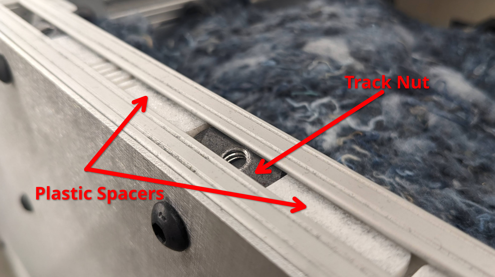

******************
Mechanical Service
******************

Regular Maintenance
===================

Installing and Uninstalling panels
==================================

The chamber is built with many laser cut panels. These panels are held to an internal aluminum
extrusion frame with 1/4-20 screws and nuts, as well as 10-32 screws and rivnuts in some places.

.. note:: When installing screws, the track nuts can often become missaligned. Leave all screws loose until each screw is started, then tighten down. This allows some flexibility to correct missalignment.
