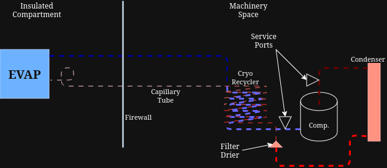
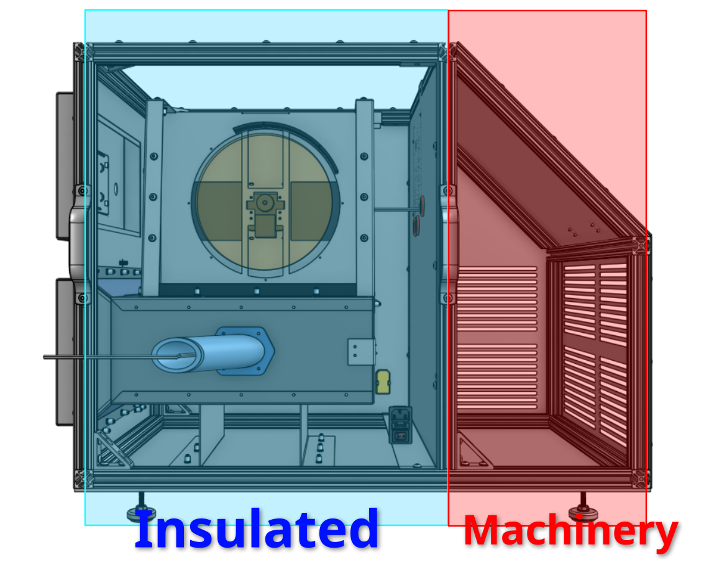
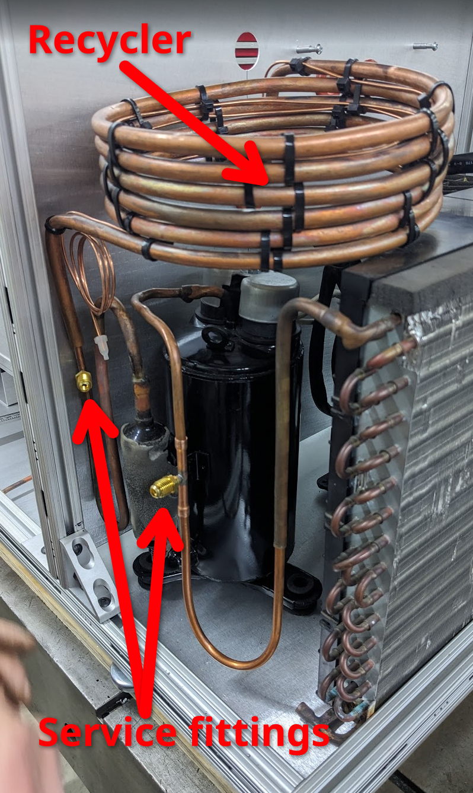

*********************
Refrigeration Service
*********************

.. warning:: The refrigeration system is complex and potentially dangerous. It should only be serviced by those 
    qualified and **licensed**. We performed all assembly under the supervision and experience of licensed 
    professionals. And we hope future maintainers of the machine will do the same.

System Structure
================

The refrigeration system is a closed loop system that uses R410 refrigerant to cool the chamber.

The system is composed of the following components:

- Compressor
- Condenser
- Recycler
- Evaporator
- Capillary Tube

Most of the machinery lives in the machinery space at the back of the chamber, accessed by the hinge machinery door.

We purposefully installed two service fittings on the machine, one on the cold low pressure return side and one on the
high pressure hot side.

We initally charged the system with around **1lb** of R410. This seemed like enough under inital testing to keep the
condensor with a good reserve at all times.
The condensor is many times larger than the evaporator or the flow that can be sustained through the capillary tube.

Specifications and Service Notes
================================

+-------------------------+--------+
|      Specification      | Value  |
+=========================+========+
| Refrigerant             | R410   |
+-------------------------+--------+
| Compressor              | 1/2 HP |
+-------------------------+--------+
| Capillary Tube Length   | 10ft   |
+-------------------------+--------+
| Capilalry Tube Diameter | 0.7mm  |
+-------------------------+--------+
| Total System Volume     | 2160cc |
+-------------------------+--------+
| Refrigerant Charge      | 1lb    |
+-------------------------+--------+