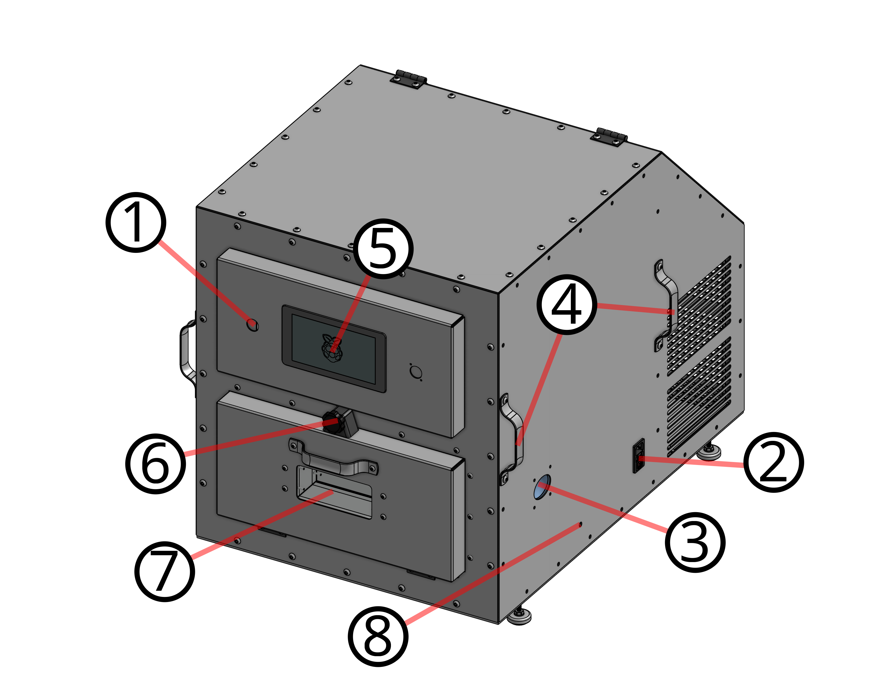
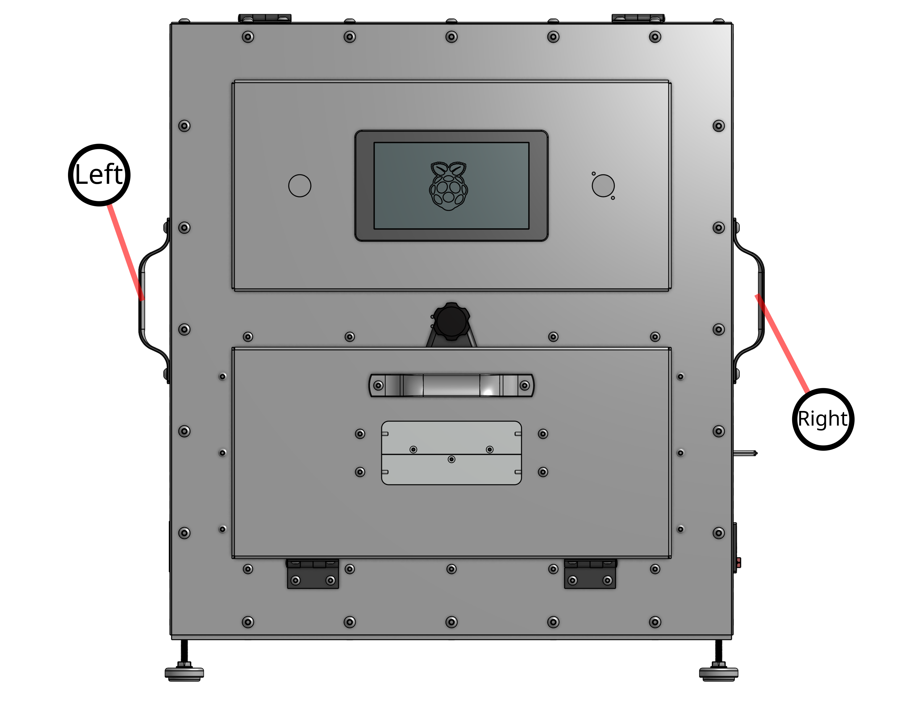
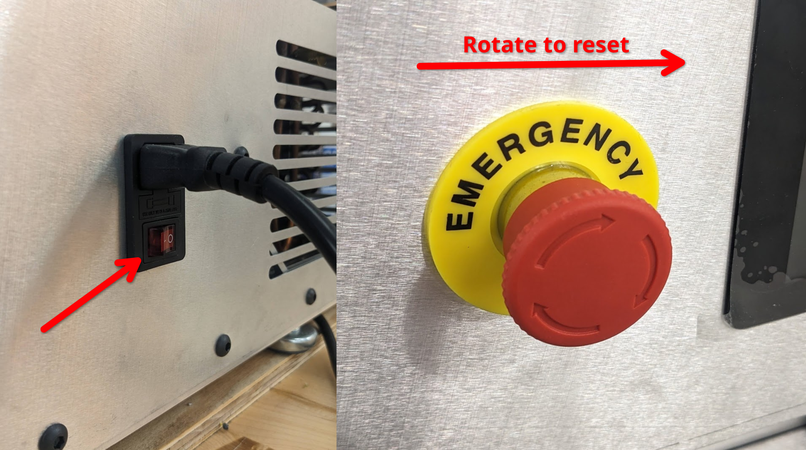
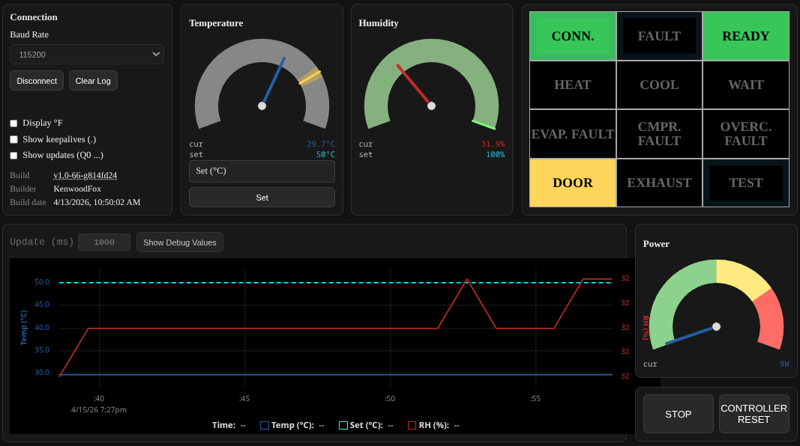
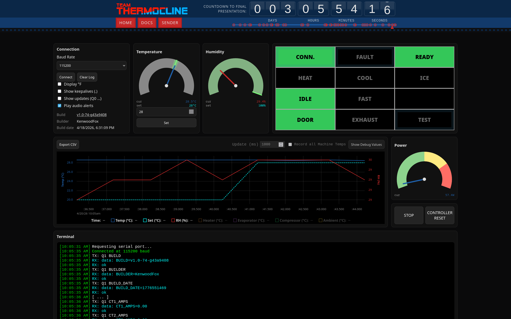
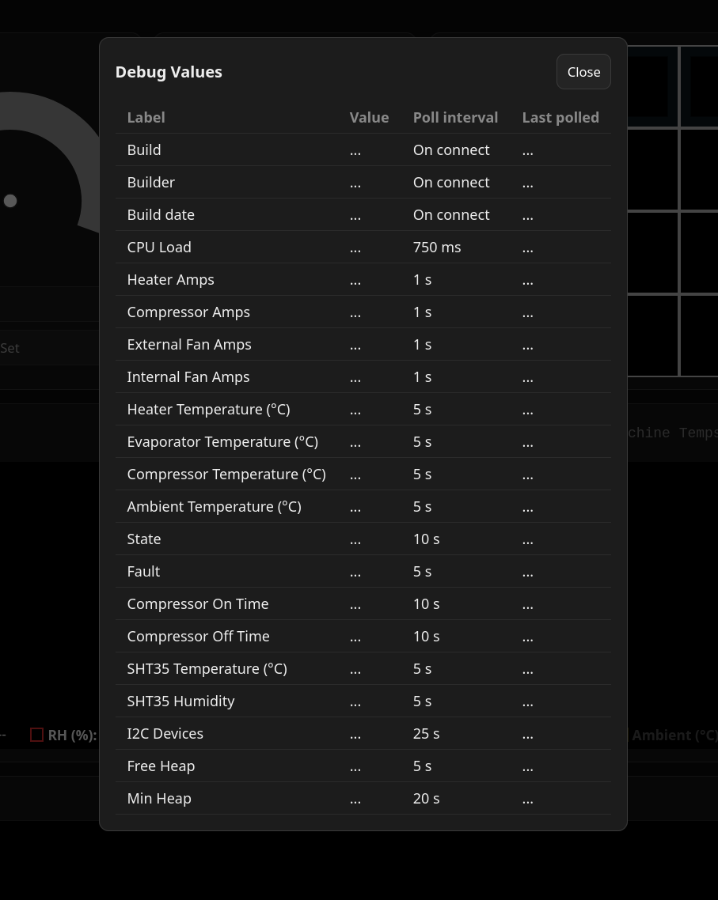

**********
Start Here
**********

The Team Thermocline Thermal Testing Chamber (Refered to as "The Chamber") is a thermal testing chamber designed to test the 
performance of electronic components in a controlled environment. It was designed as a 2025-2026 engineering capstone project 
at Southern New Hampshire University (SNHU).

+--------+-----------------------+
| Number |      Description      |
+========+=======================+
| 1      | E-Stop Button         |
+--------+-----------------------+
| 2      | IEC Receptacle        |
+--------+-----------------------+
| 3      | Wire Passthrough Port |
+--------+-----------------------+
| 4      | Lifting Handles       |
+--------+-----------------------+
| 5      | HMI Touch Screen      |
+--------+-----------------------+
| 6      | Door Locking Clamp    |
+--------+-----------------------+
| 7      | Viewing Window        |
+--------+-----------------------+
| 8      | Condensate Drain Port |
+--------+-----------------------+

This manual references things in terms of **Left** and **Right** side of the machine.

Moving the Chamber
==================

.. warning:: The Chamber is 22" by 31" and weighs about 90lb. When lifting the chamber, please use at least a *two person lift*.

The chamber has handles located on either side. With two or four people, lift each handle vertically 
to move the chamber. Do not rotate the chamber as this may cause fluids to move into unintended parts
of the plumbing. Do not shake or jostle the chamber as hard shocks can damage plumbing.

.. note:: Because the cooling system of the chamber can collect water, the chamber should be leveled
    along its long axis to allow for proper drainage.

    .. image:: images/Mechanical/Level.png

Place the chamber in such a way that there is enough area to vent air directly out the back.
Allow for no less than **8"** of clearance behind the chamber.

Powering the Chamber on
=======================

The chamber is powered by an IEC cable connected to a recepticale on the right side of the machine (when facing the front).

There are two AC interlocks, one is the red switch on the side within the IEC receptacle(2), the other is the E-Stop button on
the front(1). Both must be in the "on" position for the chamber to power on. Twist the E-Stop button to reset it back to on.

The chamber uses both a raspberry pi pico as the primary controller and a raspberry pi 5(5) as a build-in screen. The pico
should boot almost imedietly after power is applied, and should turn on the chamber lights.
**The pi 5 may take one or two minutes to boot.**

Using the HMI Touch Screen
==========================

Once the HMI is booted (which can take one to two minutes), you should see the main HMI screen.

In the top right are the status indicators, they may change color or flash to indicate important information.

+-------------+---------------------------------------------------------------------------------------+
|  Indicator  |                                         Desc.                                         |
+=============+=======================================================================================+
| CONN.       | Shows connection to the controller board.                                             |
+-------------+---------------------------------------------------------------------------------------+
| FAULT       | Indicates a current fault.                                                            |
+-------------+---------------------------------------------------------------------------------------+
| READY       | Green when ready to run or running, flashing green when you've reached your setpoint. |
+-------------+---------------------------------------------------------------------------------------+
| HEAT        | Indicates the heater is on.                                                           |
+-------------+---------------------------------------------------------------------------------------+
| COOL        | Indicates the cooler is on.                                                           |
+-------------+---------------------------------------------------------------------------------------+
| ICE         | Flashes yellow for suspected ice; flashes green during DEHUMIDIFY.                    |
+-------------+---------------------------------------------------------------------------------------+
| IDLE        | Solid green when MACHINE is IDLE                                                      |
+-------------+---------------------------------------------------------------------------------------+
| CMPR. FAULT | Indicates a fault in the compressor.                                                  |
+-------------+---------------------------------------------------------------------------------------+
| FAST        | Flashes yellow when controller is ramping as fast as it can                           |
+-------------+---------------------------------------------------------------------------------------+
| DOOR        | Indicates the door is open or not properly tightened down.                            |
+-------------+---------------------------------------------------------------------------------------+
| EXHAUST     | Indicates the condenser fan is being held on for cooling the machinery space.         |
+-------------+---------------------------------------------------------------------------------------+
| TEST        | Indicates the chamber is in test mode.                                                |
+-------------+---------------------------------------------------------------------------------------+

On the left you may choose to display temperature readings in Fahrenheit or Celsius.
You may also choose to log or not log keepalive messages as well as Q0 updates though without
a laptop connected these messages will not be shown either way.

You may choose the amount of time between Q0 updates, the default is 1000ms (1 second).

The buttons on the bottom right will set the mode of the chamber to STANDBY upon pressing the STOP button,
or reset the controller upon pressing the CONTROLLER RESET button.

.. warning:: Resetting the controller will cause it to loose its sense of time. If the controller does not know when it last ran the compressor, it may try to run the compressor too early and this could cause an overcurrent fault.

Using the Website Sender
========================

For better controls, enhanced monitoring and data export, you may connect the chamber
to a personal laptop using the USB-C port on the front of the machine. Navigate to https://team-thermocline.github.io/#sender or scan the QR code below.

The website view has all the same information as the HMI touch screen with the addition of some
features such as being able to log all the temperature readings at once to the graph and exporting
the data as a .csv file.

.. _hmi-debug-values:

Debug Values
============

On both the Website and the HMI touch screen, you may press the "Show Debug Values" button to see
more sensor information provided by the controller board, these can include
the temperature of the heater, evaporator, compressor, and ambient temperature.
Current CPU load, discovered I2C devices, safety timing lockouts as well as build and historical
information.

Debug values are color coded to what the website expects "standard values" should be. These may not
always corrolate with normal or preciesly expected values, but are meant to be a simple
troubleshooting aid to guide your eye toward anything clearly wrong.

Troubleshooting
===============

The controller is programmed to protect its most sensitive refrigerant components as well as human safety.
To this end, it will shut down and enter fault or standby mode any time it detects a fault.
Faults come with unique ASCII readable error codes. This table does not include
all possible faults but the most common and their imediete mitigations.

.. list-table:: Common fault codes
   :header-rows: 1
   :widths: 40 60
   :class: longtable

   * - Error code
     - Description
   * - | ``COMMUNICATION_ERROR``
       | ``FAULT_CODE_I2C``
     - One of the i2C devices on or off the board is not responding. Check debug values, the ADG chip is the only i2C device on board. If the SHT35 does not show up, check the i2C connector on the lower right hand of the board.
   * - | ``OPEN``
       | ``FAULT_CODE_THERMOCOUPLE``
     - Any thermocouple becoming disconnected is cause for a FAULT since the controller relies on their values to run many important control loops. Inspect the TDR0-3 input JST plugs on the upper right of the control board.
   * - | ``OVERCURRENT``
       | ``FAULT_CODE_COMPRESSOR``
     - The compressor went overcurrent on startup or during operation. Wait at least **ten minutes** before restarting the compressor after an overcurrent fault. The motor may have stalled.
   * - ``FAULT_CODE_ENV_SENSOR``
     - The internal SHT35 or another internal sensor faulted while running. Check the i2c connection and the sensor itself.
   * - ``FAULT_CODE_OVERCURRENT``
     - Any load went overcurrent during operation. Check fans and heaters. Use the debug values to monitor current when running.
