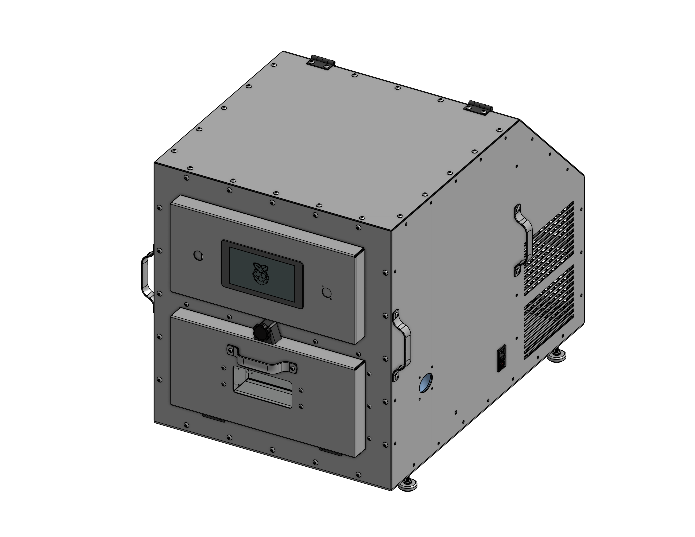
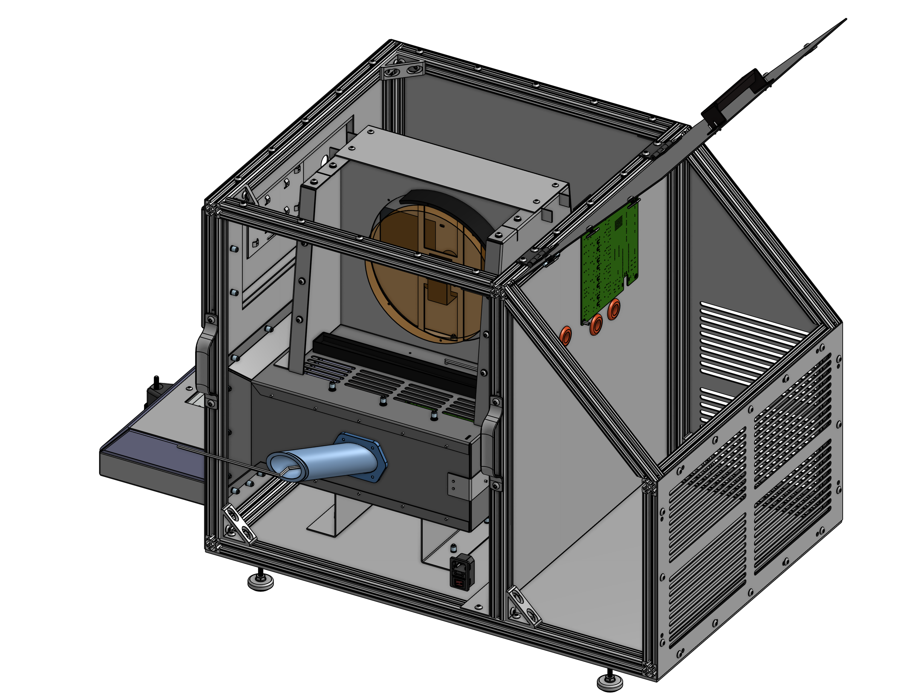

**********
Start Here
**********

Moving the Chamber
==================

The Team Thermocline Thermal Testing Chamber (Refered to as "The Chamber") is a thermal testing chamber designed to test the 
performance of electronic components in a controlled environment. It was designed as a 2025-2026 engineering capstone project 
at Southern New Hampshire University (SNHU).

The Chamber is 22" by 31" and weighs about 90lb. When lifting the chamber, please use at least a *two person lift*.

Powering the Chamber on
=======================

The chamber is powered by an IEC cable connected to a recepticale on the right side of the machine (when facing the front).
Please note the chamber is fused for 15A.

There are two AC interlocks, one is the red switch on the side controlling the system power, the other is the E-Stop button on
the front. Both must be in the "on" position for the chamber to power on. Twist the E-Stop button to reset it back to on.

The chamber uses both a raspberry pi pico as the primary controller and a raspberry pi 5 as a build-in screen. The pico
should boot almost imedietly after power is applied, and should turn on the chamber lights.
*The pi 5 may take one or two minutes to boot.*

Connecting to the Chamber
==========================

For better controls, enhanced monitoring and data export, you may connect the chamber
to a personal laptop using the USB-C port on the front of the machine.

